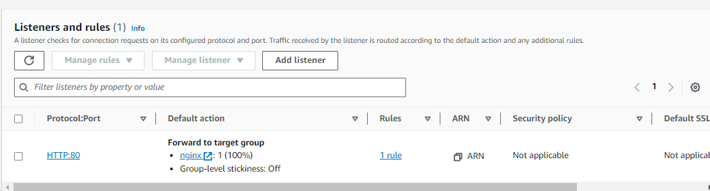

# Fault Injection Simulator

## Overview

This project aims to provide a comprehensive guide on setting up a fault injection simulator using AWS services. The simulator involves configuring two Nginx instances and placing them behind an Application Load Balancer. By utilizing AWS Fault Injection Simulator (referred to as "FIS" in this document), we can simulate the failure of one or more instances and observe how our application, represented by the Nginx welcome page, handles such failures.

Please note that this guide assumes deployment in the us-east-1 region. If deploying elsewhere, ensure to modify the region accordingly.

## Instructions

### Stage 1 - Create the instances

1. Access the EC2 console by visiting: [EC2 Console](https://us-east-1.console.aws.amazon.com/ec2/home)

2. Click on the "Launch instance" button.

3. Set the **Name** of the instance as "nginx".

4. Under the **AMI** section, select "Browse more AMIs".

   

5. Obtain the AMI ID for the Bitnami Nginx image in the region you are using. You can find the appropriate AMI ID on the following page: [Bitnami Nginx AMIs](https://bitnami.com/stack/nginx/cloud/aws/amis)

   For example, if using the Northern Virginia region, copy the AMI ID and paste it in the search bar within the EC2 console. Then, navigate to the Community AMIs tab and select the image.

   

6. Keep the **Instance type** as "t2.micro".

7. For **Key pair (login)**, choose "Proceed without a key pair (Not Recommended)". Since we won't be accessing these instances directly, a key pair is unnecessary.

8. Under **Network Settings**, click on "Edit".

9. Optionally, you can modify the **VPC** or leave it as the default VPC. Ensure that the **Subnet** is set to "No preference", but make sure to enable the **Auto-assign public IP** option.

10. Under **Firewall (security groups)**, select "Create security group" and name it "nginx". You can keep the description as is.

    

11. Remove the default SSH rule by clicking on "Remove".

12. Click on "Add security group rule".

13. Set the **Type** to "HTTP" and the **Source type** to "Anywhere".

    

14. Finally, adjust the "Number of instances" to 2 to create two instances for our simulation.

	

15.	Proceed with the default settings and click on the "Launch instance" button.

16.	Next, navigate to the instances page by selecting "View all instances."

17.	You will notice that two instances are in the process of starting.

	

18.	After a few minutes, you should be able to access both instances' public IPs using your browser. Ensure that you use `http://` instead of `https://`. You will be greeted with the Nginx welcome page.

	

## Stage 2 - Creating the Target Group

1.	Navigate to the EC2 console by visiting: https://us-east-1.console.aws.amazon.com/ec2/home

2.	Access the "Target Groups" section and click on the "Create target group" button.

	

3.	Keep the "Instances" option selected.

4.	Change the ****************Target group name**************** to "nginx".

5.	Maintain the default settings and proceed by clicking on the "Next" button.

6.	On the following page, select both instances that were created earlier, and click on the "Include as pending below" button.

	

7.	This action adds both instances to the Target Group, and their health checks will be pending. The health check, which was set on the previous page, is an HTTP call to the `/` URI, expecting a `200` response.

8.	Click on the "Create target group" button to complete the process.

## Stage 3 - Application Load Balancer Creation

To create the Application Load Balancer for your project, follow these steps:

1. Access the EC2 console by visiting the following link: [EC2 Console](https://us-east-1.console.aws.amazon.com/ec2/home).

2. Navigate to the **Load Balancers** section by clicking on **Load Balancers** in the sidebar.

3. Click on the **Create load balancer** button.

   

4. In the **Load balancer types** section, select "Application Load Balancer".

5. Set the **Load balancer name** to "nginx".

6. In the **Network mapping** section, select all available mappings. Leave the subnet as default unless you have a specific VPC configuration.

   

7. In the **Security groups** section, choose the "nginx" Security Group that you previously created in the EC2 instances console.

   

8. In the **Listeners and routing** section, change the **Default action** to the Target Group created in the previous step.

   

9. Leave all other settings as default and click on the **Create load balancer** button.

10. On the next page, click on **View load balancer**.

11. Locate and click on the name of your load balancer.

    

12. Take note of the **DNS name** as we will use it for testing.

    

13. While waiting for the provisioning, you can confirm that your instances are healthy and ready to receive traffic by clicking on the Target Group under **Listeners**.

    

14. You should see both instances listed as "Registered targets" with either the `initial` or `healthy` status.

    

15. To test the load balancer, open your browser and visit the Load Balancer DNS. You should see the Nginx welcome page.

    

16. At this stage, it is not necessary to determine which instance serves the traffic. The load balancer handles the distribution of traffic between them.

## Stage 4 - FIS IAM Role Creation

To create an IAM role for the Fault Injection Simulator (FIS), follow these steps:

1. Access the IAM console by visiting the following link: [IAM Console](https://us-east-1.console.aws.amazon.com/iamv2/home?region=us-east-1#/roles).

2. Navigate to the **Roles** section and click on **Create role**.

3. Select "AWS Service" as the **Trusted Entity Type**.

4. Under **Use cases for other AWS services**, choose "FIS" and select the "AWSFaultInjectionSimulatorEC2Access" option.

   

5. Click **Next** to proceed.

6. On the permissions page, click **Next** to skip adding any additional permissions.

7. Set the **Role name** to "FIS-Role".

8. Click **Create role** to create the role.

9. Back on the **Roles** page, search for and click on the newly created role.

   

10. Click on **Add permissions**, then select **Attach policies**.

    

11. Search for and select `AWSFaultInjectionSimulatorNetworkAccess`.

    

12. Click **Add permissions** to attach the policy to the role.

## Stage 5 - Configuring the Fault Injection Simulator

To set up the Fault Injection Simulator (FIS), follow these steps:

1. Go to the FIS console: [https://us-east-1.console.aws.amazon.com/fis/home?region=us-east-1#Home](https://us-east-1.console.aws.amazon.com/fis/home?region=us-east-1#Home).
2. On the FIS welcome screen, click on **Create experiment template**.

3.	In the **Description** field, provide a brief summary of the experiment you want to create. For example, you can enter "kill nginx" or any other relevant description.

4.	Now let's add two actions: one to reboot the instances and another to disrupt the network connectivity in the subnets.

	- Under **Actions**, click on **Add action**.
	- Set the **Name** to "reboot-nginx".
	- Set the **Action type** to "aws:ec2:reboot-instances".

	

5.	Click **Save**.

	- Under **Actions**, click on **Add action**.
	- Set the **Name** to "disrupt-network".
	- Set the **Action type** to "aws:network:disrupt-connectivity".
	- Set the **Duration** to 5 minutes and set the **Scope** to all.

	

6.	Click **Save**.

7.	To specify the targets for the actions, follow these steps:

	- Under **Targets**, click on **Edit** next to "Instances-Target-1".
	- In the **Resource IDs** section, select both of the instances you created earlier.

	

8.	Change the **Selection mode** to "Count" and set the **Number of resources** to 1. This ensures that only one instance is rebooted at a time, minimizing downtime.

9.	Click **Save**.

10.	Next, click on **Edit** next to "Subnets-Target-2".

11.	Under **Resource IDs**, select all available subnets.

	

12.	Leave the **Selection mode** as "All".

13.	Click **Save**.

14.	In the **Service Access** section, change the IAM role to the "FIS-Role" that was created in the previous step.

15	

16.	For **Stop conditions**, leave it blank. In a production environment, it may be necessary to stop fault simulations if issues arise. This can be achieved by specifying a CloudWatch alarm.

17.	Leave all other settings as default and click **Create experiment template**.

18.	Since no stop conditions have been specified, AWS will display a warning and ask for confirmation. In the confirmation box, enter "create" and click **Create experiment template**.

## Stage 6 - Initiating the FIS Experiment

Prior to commencing the experiment, it is recommended to have two separate windows or tabs open. One window should display your EC2 instances to monitor their status, while the other window should show our Nginx website.

1.	Proceed to the FIS console at the following URL: [FIS Console](https://us-east-1.console.aws.amazon.com/fis/home?region=ap-us-east-1#Home)

2.	Navigate to the section labeled "Experiment templates" and select the recently created template. Then, click on the <kbd>Start experiment</kbd> button.

	

3.	On the subsequent page, click on <kbd>Start experiment</kbd>.

4.	In the confirmation dialog box, enter the keyword "start" and click on <kbd>Start experiment</kbd>.

5.	During the process of FIS rebooting our designated instance, there should not be any noticeable disruption. In my testing, this procedure worked as expected.

6.	However, when FIS disrupts the network, it affects all subnets and consequently impairs the Application Load Balancer's ability to reach both instances. Additionally, it prevents access to the load balancer itself.

	

7.	While this activity is ongoing within the 5-minute timeframe, if you're interested, you can visit the VPC console at the following URL: [VPC Console](https://us-east-1.console.aws.amazon.com/vpc/home)

8.	Select any of your subnets under the "Subnets" section, and navigate to the "Network ACL" tab. Here, you will observe that both inbound and outbound traffic have "Deny" rules applied to all IPs (0.0.0.0/0), effectively blocking any traffic from entering or exiting the subnet.

	

10.	Once the test is complete, the Network ACL will revert to its default state with the "allow" rule restored.

	

## Stage 7 - Cleanup

1.	Proceed to the EC2 console using the following link: [EC2 Console](https://ap-northeast-1.console.aws.amazon.com/ec2/v2/home)

2.	Under the "Instances" section, select both instances named "nginx." Then, click on <kbd>Instance state</kbd> and choose <kbd>Terminate Instance</kbd>.

3.	Exercise caution to ensure that you only delete instances created specifically for this demo.

	

4.	Next, navigate to the "Load Balancers" section and select your "nginx" load balancer. Click on <kbd>Actions</kbd> and choose <kbd>Delete load balancer</kbd>.

	

5.	In the confirmation box, enter the keyword "confirm" and click on <kbd>Delete</kbd>.

6.	Proceed to the "Target Groups" section and select your "nginx" Target Group. Click on <kbd>Actions</kbd> and choose <kbd>Delete</kbd>.

	

7.	Confirm the deletion by clicking on <kbd>Yes, delete</kbd> in the confirmation box.

8.	Navigate to the "Security Groups" section and select your "nginx" Security Group. Click on <kbd>Actions</kbd> and choose <kbd>Delete security groups</kbd>.

9.	Click on <kbd>Delete</kbd> in the confirmation box.

10.	Return to the FIS console by visiting the following URL: [FIS Console](https://us-east-1.console.aws.amazon.com/fis/home?region=us-east-1#ExperimentTemplates)

11.	Go to the "Experiment Templates" section, select the previously created template, and click on <kbd>Actions</kbd>. Then, choose <kbd>Delete experiment template</kbd>.

	

12.	Enter the keyword "delete" in the confirmation box and click on <kbd>Delete experiment template</kbd>.

13.	Lastly, proceed to the IAM console using the following link: [IAM Console](https://us-east-1.console.aws.amazon.com/iamv2/home?region=us-east-1#/roles)

14.	Navigate to the "Roles" section and search for "FIS-Role". Select the role you created and click on <kbd>Delete</kbd>.

	

15.	Enter the role name "FIS-Role" in the confirmation box and click on <kbd>Delete</kbd>.
